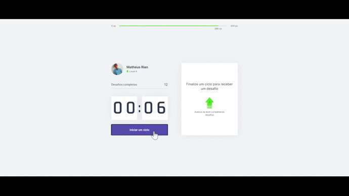

<h1 style="font-family: roboto;" align='center'>PomoMove 🚀</h1>
<h4 style="font-family: roboto;" align='center'>Inspirado no move.it desenvolvido no NLW da Rocketseat</h4>

<h1 style="font-family: roboto;" align='center'>
  </img>
  </img>
  </img>
</h1>

<h1 style="font-family: roboto;" align='center'>
  </img>
</h1>

### :pushpin: Objective

<p style="font-family: roboto;">Improve my skills from the free event made by Rocketseat.</p>

### :hammer: Requirements

Before you begin, you will need to have the following tools installed on your machine:
[Git](https://git-scm.com), [Node.js](https://nodejs.org/en/). 
In addition, it is good to have an editor to work with the code as [VSCode](https://code.visualstudio.com/)

### :rocket: Installing and running

```bash

# Clone the project:
$ git clone https://github.com/Matheus-Rian/PomoMove-next.git

# Enter the directory:
$ cd pomomove-next
  
# Installing dependencies:
$ yarn

# Running the application in development mode:
$ yarn dev
``` 

### 🏁 Features 

- [X] Interface
- [x] Countdown
- [x] Cookies storage
- [X] Level Up
- [X] Challenges
- [X] Profile
### ⚒️ Technology

The following tools were used in the construction of the project:

- [Nextjs](https://nextjs.org/)
- [React](https://pt-br.reactjs.org/)
- [TypeScript](https://www.typescriptlang.org/)

---
### :trident: Author 

<a href="https://www.linkedin.com/in/matheus-rian-19b81a183/">
 
 <br />
 <sub><b>Matheus Rian</b></sub></a> <a href="https://www.linkedin.com/in/matheus-rian-19b81a183/" title="MatheusRian">🚀</a>

 Made with ❤️ by Matheus Rian :point_right: Get in touch!

[](https://www.linkedin.com/in/matheus-rian-19b81a183/) [](souzamatheusrian@gmail.com)